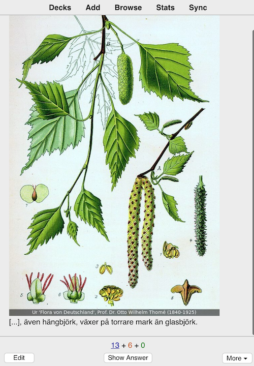

# Anki deck for the Swedish hard woods
Notes are in Swedish language and for each species cover:
 * Illustration for identification
 * Name
 * Latin name
 * Some key information (Cloze)
 
## Screenshot
[]
